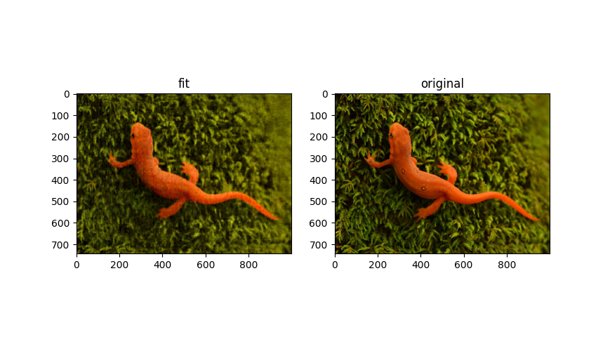

# Implicit Representation with High Order Layers
Implicit representation of various things using PyTorch and high order layers.  The network uses high order layers as implemented [here](https://github.com/jloveric/high-order-layers-torch).

Train a model
```
python implicit_images.py mlp.hidden.width=10 mlp.hidden.layers=2 lr=1e-3 mlp.n=3 mlp.periodicity=2.0 mlp.layer_type=continuous mlp.hidden.segments=2 mlp.input.segments=100 mlp.output.segments=2 batch_size=256

```

Evaluate a model example
```
python implicit_images.py train=False checkpoint=outputs/2020-12-26/15-42-25/lightning_logs/version_0/checkpoints/'epoch=8-step=190731.ckpt'
```
## Examples
The example below uses piecewise polynomials.  The input layer is the x, y position where there are 100 segments
for each input connection.  There are 2 hidden layers with 20 units each and 2 segments.  There are 3 outputs representing the RGB colors, where each output has 2 segment.  In total there are 12.3k parameters,
The raw image can be represented by 2.232e6 8bit parameters.
```python
python implicit_images.py mlp.hidden.width=20 mlp.hidden.layers=2 lr=1e-3 mlp.n=3 mlp.periodicity=2.0 mlp.layer_type=continuous mlp.hidden.segments=2 mlp.input.segments=100 mlp.output.segments=2 batch_size=256
```

