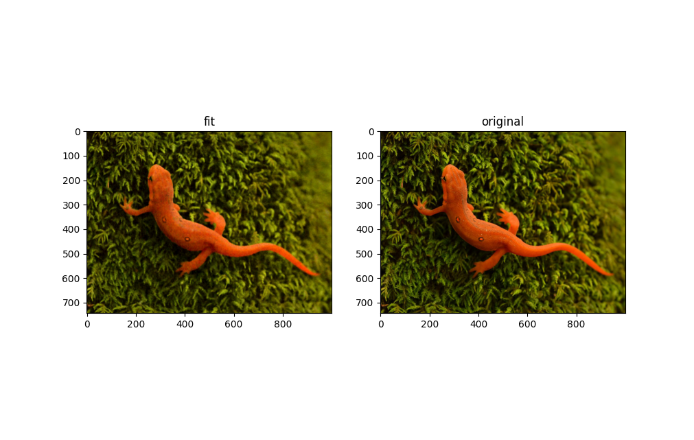
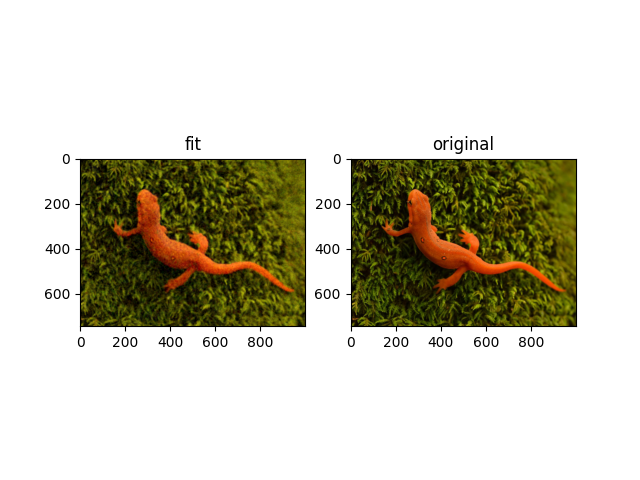
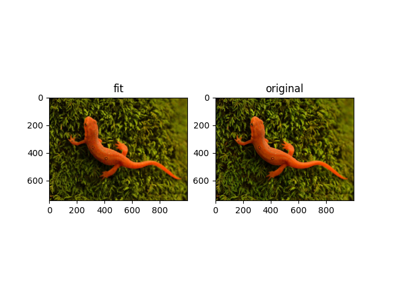
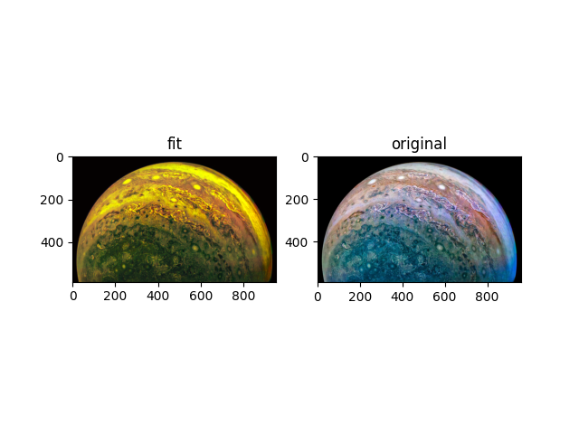

[](https://github.com/jloveric/high-order-implicit-representation/actions/workflows/python-app.yml)

# Implicit Representation with High Order Layers
Implicit representation of various things using PyTorch and high order layers.  The network uses high order layers as implemented [here](https://github.com/jloveric/high-order-layers-torch).  Implicit representation is creating a function that approximates your data (cuve fitting).  The function can be a compact representation of the original data and also provides an interpolation of that data.  Below we show example functions for images.

# Implicit Representation of Images

Train a model
```
python examples/implicit_images.py mlp.hidden.width=10 mlp.hidden.layers=2 lr=1e-3 mlp.n=3 mlp.periodicity=2.0 mlp.layer_type=continuous mlp.hidden.segments=2 mlp.input.segments=100 mlp.output.segments=2 batch_size=256
```

Evaluate a model example
```
python example/implicit_images.py train=False checkpoint=\"multirun/2021-01-10/18-31-32/0/lightning_logs/version_0/checkpoints/epoch=49-step=145349.ckpt\" rotations=2
```
## Examples
### Piecewise Continuous
The example below uses piecewise quadratic polynomials.  The input layer is the x, y position where there are 100 segments
for each input connection.  There is 1 hidden layers with 40 units each and 2 segments.  There are 3 outputs representing the RGB colors, where each output has 2 segment.  In total there are 40.8k parameters,
The raw image can be represented by 2.232e6 8bit parameters.
```python
python examples/implicit_images.py -m mlp.hidden.width=40 mlp.hidden.layers=1 lr=1e-3 mlp.n=3 mlp.periodicity=2.0 mlp.layer_type=continuous mlp.hidden.segments=2 mlp.input.segments=100 mlp.output.segments=2 batch_size=256 mlp.input.width=4 rotations=2
```

### Fourier Series
similarly with a fourier series network
```python
python examples/implicit_images.py -m mlp.hidden.width=40 mlp.hidden.layers=1 lr=1e-3 mlp.n=3 mlp.n_in=31 mlp.layer_type=fourier batch_size=256 mlp.input.width=4 rotations=2
```

### Piecewise Discontinuous
and discontinuous polynomial
```python
python examples/implicit_images.py -m mlp.hidden.width=40 mlp.hidden.layers=1 lr=1e-3 mlp.n=3 mlp.periodicity=2.0 mlp.layer_type=discontinuous mlp.hidden.segments=2 mlp.input.segments=100 mlp.output.segments=2 batch_size=256 mlp.input.width=4 rotations=2
```


# Implicit Neighborhoods
Train interpolator / extrapolator
```
python examples/implicit_neighborhood.py mlp.hidden.width=10 mlp.hidden.layers=2 lr=1e-3 mlp.n=3 mlp.periodicity=2.0 mlp.layer_type=continuous mlp.hidden.segments=2 mlp.input.segments=100 mlp.output.segments=2 batch_size=256
```
create output with trained filter
```
python examples/implicit_neighborhood.py train=False checkpoint=<>
```
Training on the image of the newt and applying to the image of jupiter gives
the following results.


# Random Interpolation (A Generative Model)
This model picks random pixels and also the pixels locations relative to a target pixel as the training set.  The random pixels also have location information while the target pixel is always at (0,0) as all other pixels are measured relative.  The model learns to predict the
pixel value from these random samples.
```
python examples/random_interpolation.py mlp.hidden.width=10 mlp.hidden.layers=2 mlp.n=3 mlp.periodicity=2.0 mlp.hidden.segments=2 mlp.input.segments=100 mlp.output.segments=2 batch_size=1
```